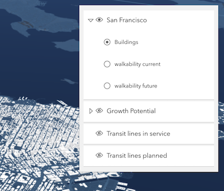

<!-- .slide: data-background="img/2022/dev-summit/bg-1.png" data-background-size="cover" -->

<h1 style="text-align: left; font-size: 80px;"><div><small>ArcGIS API for JavaScript:</small></div> Build a custom UI for API widgets</h1>

<p style="display: flex; line-height: normal; gap: 14px; color: var(--r-section-subhead-color);"><calcite-avatar scale="l" full-name="Matt Driscoll" thumbnail="./img/matt.jpeg"></calcite-avatar>Matt Driscoll <calcite-avatar scale="l" full-name="Ryan Libed" thumbnail="./img/ryan.jpeg" style="margin-left: 14px"></calcite-avatar>Ryan Libed</p>

<p style="text-align: left; font-size: 30px;">Slides + Demos: <a href="https://esriurl.com/ds2022-custom-ui"><code>esriurl.com/ds2022-custom-ui</code></a></p>

---

# Agenda

- Widget fundamentals
- LayerList Widget
- Creating custom widget UI
  - Setup JSAPI + React
  - React + Bootstrap
  - React + Calcite Design System
- Resources
- Q & A

---

<!-- .slide: data-background="img/2022/dev-summit/bg-7.png" data-background-size="cover" -->

# Widget Fundamentals

---

# What are widgets?

- A component of UI
- Perform a function
- Interactive
- Stateful


---

# Benefits of Widgets

- Reusable & modular <calcite-icon scale="l" icon="round-about"></calcite-icon>
- Configurable <calcite-icon scale="l" icon="gear"></calcite-icon>
- Help build more complex apps <calcite-icon scale="l" icon="wrench"></calcite-icon>

---

# Widget Architecture

ArcGIS Javascript API Widgets are composed of Views & ViewModels

- Business logic is separate from presentation
- Reusable logic
- UI replacement
- Framework integration

---

# Widget Views

Presentation of the widget

- Extends `esri/widgets/Widget`
  - example: `esri/widgets/Search`
- Focused on UI & DOM structure
- Use ViewModel APIs to render UI

---

# Widget ViewModels

Business logic of the widget

- Extends `esri/core/Accessor`
  - example: `esri/widgets/Search/SearchViewModel`
- Provides APIs to support View
- Focuses on business logic
- No DOM

---

# View + ViewModel in action


- View renders the state of the VM
  - Looks at properties on VM and renders accordingly
- User interacts with View (property/method)<!-- .element: class="fragment" data-fragment-index="1" -->
  - Causes a change on VM or View
- View updates <!-- .element: class="fragment" data-fragment-index="2" -->
  - Renders again due to changes on VM

---

# Custom Widgets?

Best practices for building a custom UI.

- Use widget viewModels to render custom UI
  - Watch properties state
  - Events
- Use your preferred
  - Framework
  - CSS Library
  - Design System

---

# LayerList Widget

[](https://developers.arcgis.com/javascript/latest/sample-code/widgets-layerlist/)

- [Sample](https://developers.arcgis.com/javascript/latest/sample-code/widgets-layerlist/)
- [SDK](https://developers.arcgis.com/javascript/latest/api-reference/esri-widgets-LayerList.html)

---

# React

---

# React

- JavaScript library for building user interfaces
- Virtual DOM
- JSX (JavaScript Syntax Extension)
- One-way data binding

---

# Create React App (CLI)

New Apps:

<pre data-id="code-animation"><code class="hljs" data-trim>
npx create-react-app my-app --template typescript

# or

yarn create react-app my-app --template typescript
</code></pre>

Existing Apps:

<pre data-id="code-animation"><code class="hljs" data-trim>
npm install --save typescript @types/node @types/react @types/react-dom @types/jest

# or

yarn add typescript @types/node @types/react @types/react-dom @types/jest
</code></pre>

---

# TypeScript

- JavaScript with syntax for types
- Open-source programming language developed by Microsoft
- Superset of JavaScript
- Helps with code management
- Throws errors to catch issues earlier on in development

---

# Bootstrap

- Open-source CSS framework
- Mobile-first
- Responsive
- CSS and JavaScript-based design templates

---

# ArcGIS API for JavaScript

[JS API](https://developers.arcgis.com/javascript/latest/) + [ES modules](https://developers.arcgis.com/javascript/latest/tooling-intro/)

- [Build with ES modules](https://developers.arcgis.com/javascript/latest/es-modules/)
- [JSAPI esm samples](https://github.com/Esri/jsapi-resources/tree/master/esm-samples)

---

<!-- .slide: data-background="img/2022/dev-summit/bg-7.png" data-background-size="cover" -->

# React + TypeScript + LayerListViewModel

Create React App with TypeScript and implement LayerListViewModel

---

<!-- .slide: data-background="img/2022/dev-summit/bg-7.png" data-background-size="cover" -->

# React + Bootstrap

Take LayerList in React and add Bootstrap

---

<!-- .slide: data-background="img/2022/dev-summit/bg-7.png" data-background-size="cover" -->

# React + Calcite Components

Build a LayerList using React and Calcite Components

---

<!-- .slide: data-background="img/2022/dev-summit/bg-7.png" data-background-size="cover" -->

# Calcite: Esri's design system

- Visual language for products
  - Design guidelines
    - Color, Spacing, Typography...
  - Graphic resources (Icons, symbols, Figma UI Kit)
  - Interactive documentation
    - Patterns & best practices
  - Reusable components
- Closes the gap between designers and UI engineers
- [Documentation](https://developers.arcgis.com/calcite-design-system/)

---

# Calcite components

- [Web Components](https://developers.arcgis.com/calcite-design-system/components/) for Calcite Design System
  - 50+ web components
    - Ready to use
    - Reusable
    - Provides a library of patterns
  - Internal & external use
    - [Developer subscription](https://developers.arcgis.com/pricing/build-arcgis-solutions/)
  - Easily build beautiful consistent apps

---

# Benefits of Calcite

- Consistent UX
- Speed up development timelines
- Accessibility
- Web standards
- Framework integration

---

<!-- .slide: data-background="img/2022/dev-summit/bg-7.png" data-background-size="cover" -->

# About Web Components

- Custom elements
  - Browser-compatible elements
  - Use native APIs
  - DOM element lifecycle
- Shadow DOM
  - Encapsulates component HTML & CSS
  - `<slot>` tag for distributing content
- [Slotting](https://developers.arcgis.com/calcite-design-system/faq/#what-are-slots)

```html
<my-component><button slot="footer" /></my-component>
```

---

<!-- .slide: data-background="img/2022/dev-summit/bg-7.png" data-background-size="cover" -->

# Calcite Design


---

# Design Components


---

# PickList Calcite Component

[](https://developers.arcgis.com/calcite-design-system/components/pick-list/)

---

# Panel

[](https://developers.arcgis.com/calcite-design-system/components/panel/)

---

# Shell/Shell Panel

[](https://developers.arcgis.com/calcite-design-system/components/shell/)

---

# Calcite Components React

- A set of React components that wrap Calcite Components
- [NPM Package](https://www.npmjs.com/package/@esri/calcite-components-react)

```node
npm install --save @esri/calcite-components-react
```

---

# DEMO: React + Calcite Components

---

<!-- .slide: data-background="img/2022/dev-summit/bg-7.png" data-background-size="cover" -->

# Resources

- Calcite Design System: https://developers.arcgis.com/calcite-design-system/

- ArcGIS API for JavaScript: https://developers.arcgis.com/javascript/latest/

- React: https://reactjs.org/

- Create React App: https://create-react-app.dev/

- TypeScript: https://www.typescriptlang.org/

- Bootstrap: https://getbootstrap.com/

---

# Please Share Your Feedback in the App​


---

<!-- .slide: data-background="img/2022/dev-summit/bg-7.png" data-background-size="cover" -->

# Questions? 🤔

<p>Slides + Demos: <a href="https://esriurl.com/ds2022-custom-ui"><code>esriurl.com/ds2022-custom-ui</code></a></p>

---

<!-- .slide: data-background="img/2022/dev-summit/bg-8.png" data-background-size="cover" -->
